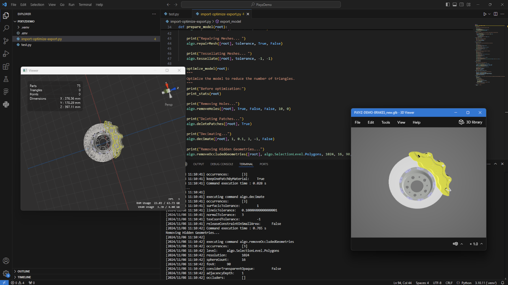

# Asset Transformer (Pixyz) SDK

## Visual Studio Code Setup Guide

This guide will walk you through setting up the Pixyz SDK with Visual Studio Code on a Windows machine.




---

## Resources

- **[Get the Asset Transformer SDK](https://www.pixyz-software.com/)**
- **[Asset Transformer SDK Documentation](https://www.pixyz-software.com/documentation)**
- **[Visual Studio Code](https://code.visualstudio.com/)**  
  Make sure to install the Python extensions for Visual Studio Code.

---

## Setup Steps

### Project Preparation

1. **Unzip the Asset Transformer API Binaries**  
   Extract the downloaded Asset Transformer SDK binaries to your desired location.

2. **Create a New Project in Visual Studio Code**  
   Launch Visual Studio Code and open an empty folder. This folder will serve as your project workspace.


### Managing Dependencies

1. **Set Up the Python Environment**  
   - Open the command palette by pressing `Ctrl+Shift+P`.
   - Select `Python: Create Environment` and choose `venv` as the environment.

2. **Configure the Python Path**  
   - Create an empty `.env` file at the root of your project.
   - Add the following line to the `.env` file, replacing the path with the location of your Pixyz SDK binaries:
     ```plaintext
     PYTHONPATH={env:PYTHONPATH};C:\\Path\\To\\The\\PiXYZAPI-2025.XXX-win64\\bin
     ```

3. **Ensure Visual Studio Code Uses the `.env` File**  
   - Go to `File > Preferences > Settings`.
   - Search for `Python > Env File` in the settings.
   - Set the value to `${workspaceFolder}/.env`.

---

### Test the Setup

1. **Create a Test Script**  
   - Create a file named `test.py` in the root of your project.
   - Add the following code to test the Pixyz SDK:

     ```python
     import pxz
     from pxz import core

     # Initialize Pixyz
     pxz.initialize()

     # Print Pixyz version
     print(core.getVersion())
     ```

2. **Run the Test Script**  
   - Save the `test.py` file.
   - Click the run button or execute the script from the terminal.

3. **Verify the Output**  
   When the setup is configured correctly, the output should display:
   ```plaintext
   Initializing with default product name: PixyzSDK
   [YYYY/MM/DD HH:MM:SS] Pixyz SDK (SDK v2025.2XXX)

Congratulations! You have successfully set up the Asset Transformer SDK with Visual Studio Code. For further assistance, refer to the documentation.

# Simple Import-Optimize-Export Demo

This tutorial will guide you through creating a Python script to import, optimize, and export a 3D dataset using the Pixyz SDK API. The steps include:

1. Initializing the SDK.
2. Checking for the required license.
3. Importing the 3D model.
4. Preparing and optimizing the model.
5. Exporting the optimized model.

---

## Step-by-Step Instructions

### 1. Set Up the Script Entry Point

Create a new Python script and define the entry point for the script execution. This informs Python where to start running the script.

```python
if __name__ == '__main__':
    main()
```
### 2. Define the Main Function

The main function is responsible for loading the model and orchestrating its optimization and export.

```python
def main():
    model_file_path = "C:\\Users\\SAMPLE-DEMO-BRAKES\\PiXYZ-DEMO-BRAKES.CATProduct"
    
    init_pixyz()
    get_pixyz_license()
    
    if core.checkLicense():
        print("License Available")
        
        root = import_model(model_file_path)
        prepare_model(root)
        optimize_model(root)
        export_model(model_file_path, "_new.glb", root)
    else:
        print("No License Available")
```
### 3. Initialize Pixyz SDK

The init_pixyz() function initializes the AssetTransformer SDK and configures the logging level.

```python
def init_pixyz():
    """
    Initialize Pixyz and configure log level to INFO.
    """
    pxz.initialize()
    print(core.getVersion())
    core.configureInterfaceLogger(True, True, True)
    core.addConsoleVerbose(core.Verbose.INFO)
```

### 4. Configure AssetTransformer License

The get_pixyz_license() function checks for an available license and configures the AssetTransformer license server if none is found.

```python
def get_pixyz_license():
    """
    Configure AssetTransformer license server if no license is found and add all available tokens.
    """
    if not core.checkLicense():
        core.configureLicenseServer("licenserver", 27005, True)
    for token in core.listTokens():
        try:
            core.needToken(token)
        except Exception as e:
            print(f"Failed to add token {token}: {e}")
```

### 5. Import the Model

The import_model(filepath) function loads a 3D model specified by the filepath.

```python
def import_model(filepath):
    """
    Import model from specified filepath.
    """
    print(f"Importing {filepath}... ")
    return io.importScene(filepath)
```
### 6. Prepare the Model

In prepare_model(root), the model is prepared by repairing CAD and mesh data and tessellating it.

```python
def prepare_model(root):
    """
    Prepare the model by repairing CAD and meshes and tessellating.
    """
    tolerance = 0.1
    
    print("Repairing CAD... ")
    algo.repairCAD([root], tolerance, False)

    print("Repairing Meshes... ")
    algo.repairMesh([root], tolerance, True, False)

    print("Tessellating Meshes... ")
    algo.tessellate([root], tolerance, -1, -1)
```

### 7. Optimize the Model
The optimize_model(root) function reduces the number of triangles by applying various optimization techniques.

``` python
def optimize_model(root):
    """
    Optimize the model to reduce the number of triangles.
    """
    print("Before optimization:")
    print_stats(root)

    print("Removing Holes...")
    algo.removeHoles([root], True, False, False, 10, 0)

    print("Deleting Patches...")
    algo.deletePatches([root], True)

    print("Decimating...")
    algo.decimate([root], 1, 0.1, 3, -1, False)

    print("Removing Hidden Geometries...")
    algo.removeOccludedGeometries([root], algo.SelectionLevel.Polygons, 1024, 16, 90, False, 1)
    
    print("Optimized:")
    print_stats(root)
```

### 8. Print Model Statistics
A helper function print_stats(root) prints model statistics such as the number of triangles, vertices, and parts.

``` python
def print_stats(root):
    """
    Print statistics of the given model root.
    """
    core.configureInterfaceLogger(False, False, False)
    
    triangles = scene.getPolygonCount([root], True, False, False)
    vertices = scene.getVertexCount([root], False, False, False)
    parts = len(scene.getPartOccurrences(root))
    
    core.configureInterfaceLogger(True, True, True)
    
    print("Model stats: ")
    print(f"Triangles: {triangles}")
    print(f"Vertices: {vertices}")
    print(f"Parts: {parts}")
```

### 9. Export the Optimized Model
The export_model(filepath, extension, root) function exports the optimized model to the specified file path with the chosen extension.

``` python
def export_model(filepath, extension, root):
    """
    Export model to specified filepath with a given extension.
    """
    folder_path = os.path.dirname(filepath)
    filename = os.path.splitext(os.path.basename(filepath))[0]
    final_path = os.path.join(folder_path, filename + extension)
    print(f"Exporting {final_path}... ")
    io.exportScene(final_path, root)
```

And that's it! You've successfully created a script to import, optimize, and export a 3D dataset using the AssetTransformer SDK. Now you can run this script to see the process in action.


